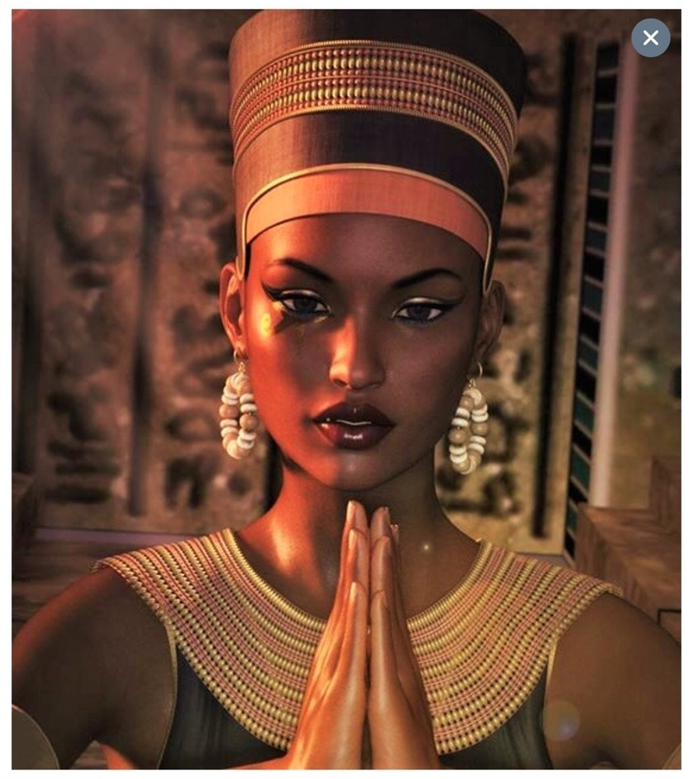

[[TODO]] à lire #livre :
Liber ivonis latin
fragments de gharne
Livre de Dzyan

la mosquée [[Ibn Tulun]] a été attaquée 

un guerrier saint va nous suivre : Yassif 

on apprend fléttrissement #sortilege 

on arrive dans la pyramide pour arreter le rituel. des 10aines 
[[Niktoris]] a tué son mari dans un banquet avec tout les invités, puis s'est suicidé pour que personne ne la tue. Une autre version indique qu'elle a été enmurée vivante

[[Omar Shakti]]

le chat hetep

tueur soudanais 

sarcophage de [[Niktoris]] 

[[Niktoris]] quand elle était vivante 

[[Omar Shakti]] me sortilege: 3 doigts de la main droite retourné à la poussière (-1 dex)

[[Niktoris]] en momie 

[[sphynx noir]]

le sphynx m'enlève 29 points de SAN 

[[TODO]]  aller au #kenya #Mombasa et #Nairobi